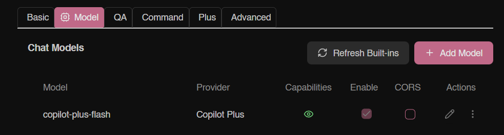
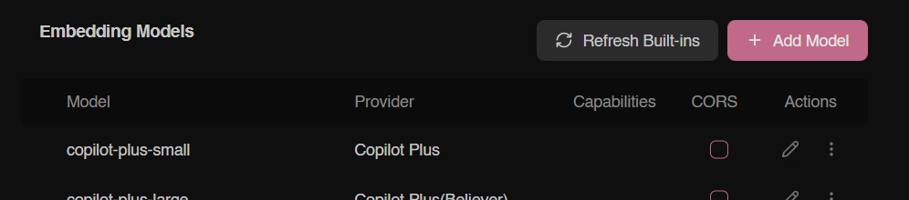
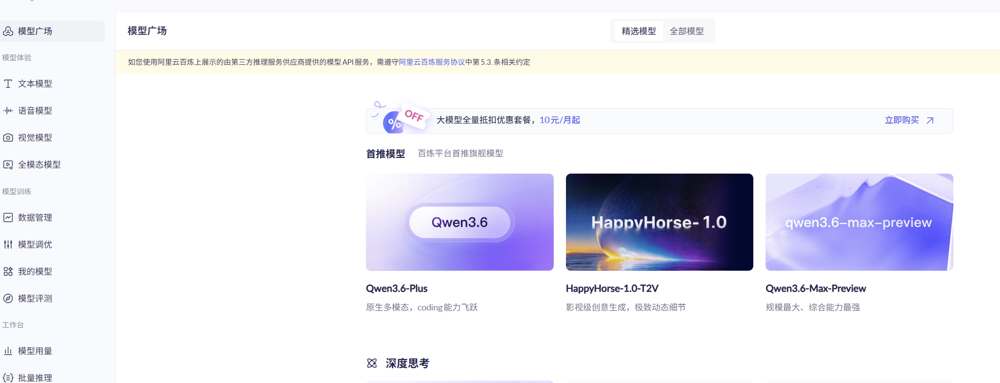
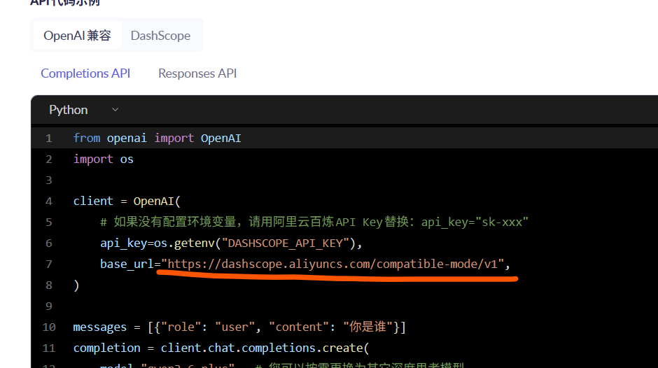
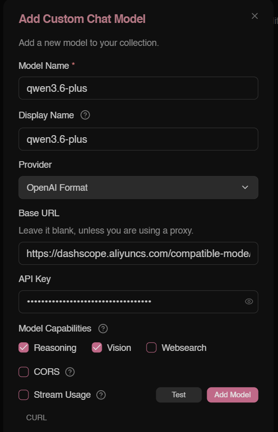
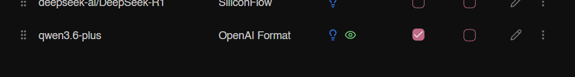
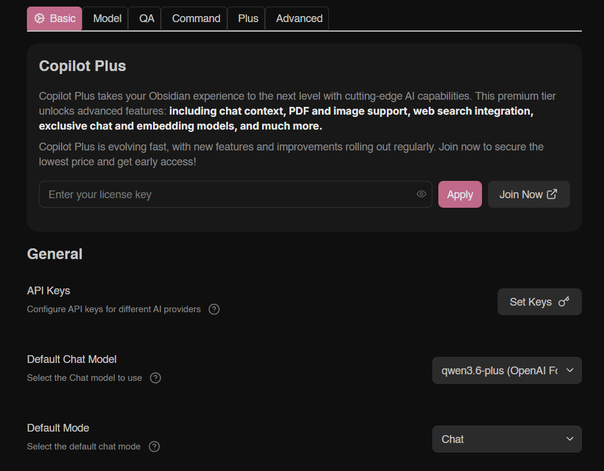
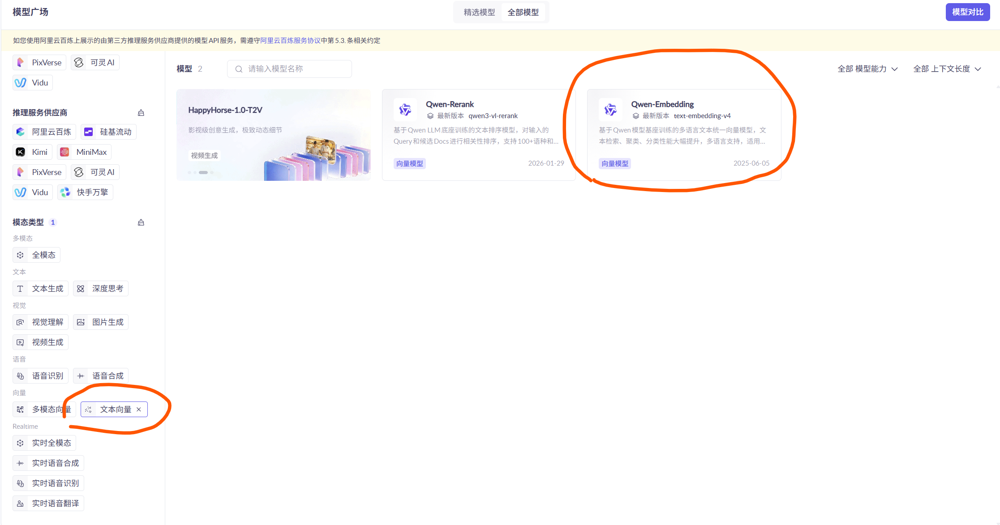
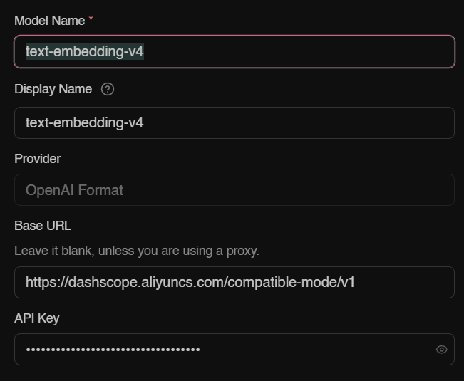
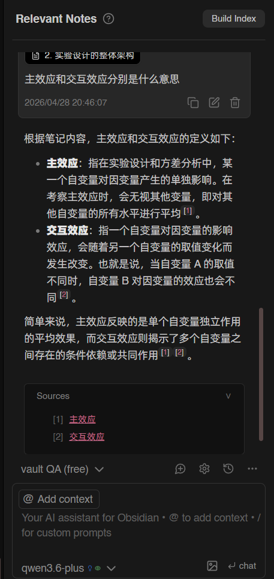

主要想在obsidian写作的时候让AI基于本地文件生成内容并给我来源。在国内不容易给国外api付款，加上不想用中转站，所以选择用qwen大模型了。

# 1 安装Copilot 插件

首先在插件市场安装copilot，进入设置页面，进入第二个tab “model”。model页面分为两个部分，上面是chat models，适用于聊天的；下面是embedding models，用来处理当前vault中的文件并进行问答。所以需要先在这两个地方add model把国产大模型加进去。

# 2 获取大模型api与base_url

阿里云网页对小白而言的易学性好差……简单记录一下步骤：
1. 打开阿里云的[百炼大模型控制台](https://bailian.console.aliyun.com/)，登录一下，进入API Key，创建API（所有都选默认），就可以生成一串API复制走了。

2. 进入模型广场，随便选择一个模型，比如Qwen3.6-Plus。

3. 进入后滚到下面的API代码示例，里面有一行`base_url`，把后面的连接复制走。

# 3 添加chat model

回到obsidian的copilot设置页面的model页面，点右上角的add model按钮，进行如下配置。对于qwen，其中Provider选OpenAI Format，Base URL填在百炼网站拷过来的base_url，API Key填前面生成的一串API。qwen3.6可以勾上reasoning和vision功能。设置好后先点test，显示成功后再点add model按钮。

这样它就出现在了chat model 的最下面，把它的enable那一列勾上。

然后回到Basic里，把Default chat model选成刚加的qwen3.6-plus。

然后chat功能就搞好了，可以在左侧工具栏点对话气泡，就能打开chat窗口在侧面了。

# 4 添加QA model

接着可以配置AI基于当前obsidian vault中的文件进行检索和问答的功能，需要配置copilot设置中“model”页面下面的embedding models。所以回到百炼网站，在模型广场左边筛选文本向量，然后右边筛选结果中找到Qwen-Embedding，复制模型名，比如这里是text-embedding-v4。

然后进入copilot设置中“model”页面下面的embedding models，点add model，输入刚刚复制的模型名。其他几栏（Provider、Base URL、API Key）和刚刚的chat model填一样的内容。test通过后就可以确定了。

这样就配置好了！在侧面的对话中，可以根据笔记来进行问答，它会给出文件引用来源👍 非常好！
